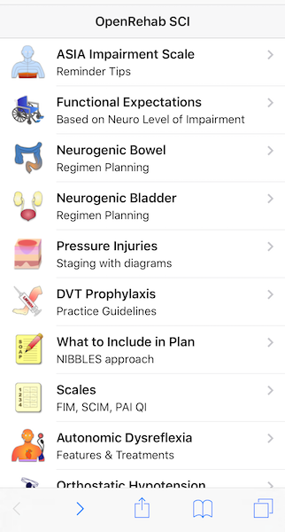
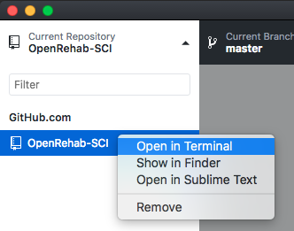
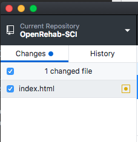
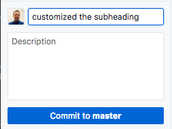
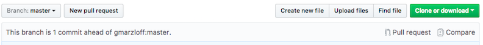
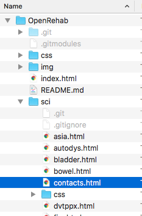
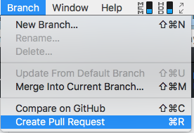
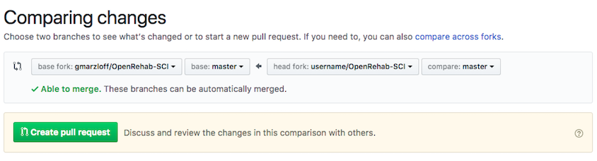

# Spinal Cord Injury Module


## Introduction



Residents use their mobile devices frequently throughout the day for reference apps and websites such as UpToDate, Epocrates, Medscape.  However, the information is generalized and lacks useful information specific to a particular residency program. We have developed an open-source web app designed as a reference for use on rehab medicine rotation that users with little to no experience can:

1. download from a code repository
2. customize to their residency program
3. create new features
4. push new features back to the repository to contribute to the project.

If you want the full suite of reference apps installed complete with a launch page, you probably want the [OpenRehab superproject](https://github.com/gmarzloff/OpenRehab). See **Basic Installation** in that README.

If you want to quickly get your own "out-of-the-box" copy working of the SCI module only, you have git installed and are comfortable with using the command line, see [Basic Installation](#basic-installation) below. 

If you are completely new to HTML and git, please try the tutorial below to get started. 

## Tutorial
The tutorial is designed for users with no software programming experience. Objectives are:
 
1. Download and setup a web app project on your own computer
2. Create a new feature
3. Push your new feature back to the code repository for others to use. 

Open Rehab is a web app, meaning you access it in a phone browser, and you do not need to install anything from an app store. A slightly modified version of this tutorial was tested in users with no experience, and results were presented at the Association of Academic Physiatrists' annual meeting. **The average time to complete was 26 minutes.** After this tutorial is done, you can easily remove the few things installed if desired.

### Step 1. Install Sublime Text

[Sublime](https://www.sublimetext.com/3) is a text editor, like a fancy version of Notepad, used for writing code.

(For Mac users: open the file you downloaded and drag to your Applications.
Windows users: double click the .exe file to run the installation file)

### Step 2. Create a free Github [account](https://github.com/)
Github's slogan is *how people build software*. Millions of developers use GitHub to build personal projects, support their businesses, and work together on open source technologies. The OpenRehab project is stored on Github. 

### Step 3. Fork the OpenRehab-SCI repository

Click the "Fork" button on the top right. Forking a repository creates a copy of it within your account. 

You are in the OpenRehab-SCI repository. A repository contains a set of files and the details of every change ever made by the software development team. Github is a cloud service for storing repositories, and it offers other useful collaborative tools such as issues and tasks managers.   

### Step 4. Download Github Desktop

[Github Desktop](https://desktop.github.com/) provides a graphical user interface to work with your github repositories. Open it after it is installed and login with your new Github account. 

### Step 5. Clone the newly forked OpenRehab-SCI project

Cloning simply means downloading a copy of the project to your computer.

1. In Github Desktop, choose File->Clone repository... and find `username/OpenRehab` in the list. 
2. Click the  "Clone" button. This will download the project to your hard drive. 

#### Quick Tour


You should see 3 columns: 

- The left column shows your available repositories on your computer. Cick OpenRehab-SCI if it is not the current repository.
- Click the "History" tab, and you will see the middle column shows a reverse-chronological timeline of "commits." A **commit** is like a bookmark a developer creates after making some changes to the code. The commit history allows you to see what changes were made and when. 
- The right column shows details of what changes were made with the selected commit time point. Green highlights represents lines of code added, and pink highlights mean that text was removed from the file. 


### Step 6. Start up a web server  

You will host a website on your own computer that is accessible only on your computer and your home network if you are connected via wifi at home. 

**Mac users:** The software (python) is already installed on Mac OSX / macOS. 

**Windows users:** You will have to download [python 2.7.x](https://www.python.org/ftp/python/2.7.12/python-2.7.12.msi). Install it when it has finished downloading.

1. In Github Desktop, right-click (or Ctrl+Click on a Mac touchpad) on **OpenRehab-SCI** and choose "Open in Terminal" in Mac/Linux or "Open in Git Shell" in Windows

  

2. Mac users: skip this step. Windows users: You need to tell GitShell where to find the python software you just installed. To do this, copy and paste the following command into GitShell, and hit enter. Do not include the $ sign.

  ```
  $ [Environment]::SetEnvironmentVariable("Path", "$env:Path;C:\Python27","User")
  ```
  Now quit GitShell, and repeat step 6.1 to open it again. This is the only time you will have to do this ever.
  
3. Paste the python command into Terminal (or GitShell) and hit enter to start the server.
  
  ```
  $ python -m SimpleHTTPServer 8000
  ```
4.  Then open the web app in a browser: [http://localhost:8000](http://[ip address]:8000). This requests the web app from your local webserver. When you make edits, you will be able to see them here. You can also view the app in a mobile browser with a device on the same network as your web server. [Details below.](#view-on-mobile-device). When you want to stop the server later, type Ctrl+C. Also note, there are many other server options to run this such as Apache, Node.js, and nginx. 


### Step 7. Customize the existing code
1. Open Sublime Text editor. Choose File -> Open and navigate to the OpenRehab-SCI folder, and open the `index.html` file. This is an HTML file, a plain text file that describes the structure of a webpage to a web browser.
1. Find line 36 that represents a subheading for the app and customize it to your program. 
 	
 	before:
 	`<div class="center sliding">OpenRehab SCI</div>`
 	
 	after: `<div class="center sliding">ABC University SCI</div>`

1. Save the file, then click into your web browser and hit the Refresh button. You should see the title text of the web app updated. If you are not seeing the update, try holding Shift as you click the refresh button.
1. Commit this change:
   1.  Switch back to Github Desktop
   2.  Click the "Changes" button tab on the top left.
  
  		
  		
      You will see the change you made to the subheading highlighted in green on the right. 
      
   3. In the bottom left, type in the Summary field a comment describing what you did:
  
     
     
   4. Click **Commit to master**. With this commit, you have created a record in the change history of your local web app. You can see this commit in the "History" tab now.
   
1. Click **Push origin** to send this commit back to *your* fork of the repository on the Github server. This push only updates your forked copy and does not affect the original repository (by gmarzloff). You can see this if you refresh the Github webpage of your fork (just to be clear - the url should look like `https://github.com/your-username/OpenRehab-SCI`). 

Look at the message above the directory listing: 

   

   This notifies you that your fork is one commit *ahead* of the parent repository in the repository timeline. In Steps 8-9, you will make another commit and submit a *pull request* to the original repository to have your changes incorporated into that version. 

### Step 8. Create a new feature - Program Contacts page
In this step, we will create new content: a contact list for the SCI team. We will add this feature to the SCI app.  

1. First, we will create an item in the SCI app list called "Program Contacts." In Sublime Text, open the `index.html` file. Find `</li>` near line 174, and paste the following HTML content below that line: 

  ```
  <li><a href="contacts.html" class="item-link">
    <div class="item-content"> 
        <div class="item-media">
<i class="icon f7-icons" style="font-size: 45px">person-fill</i>
</div>
       <div class="item-inner">
             <div class="item-title-row">
                 <div class="item-title">Program Contacts</div>
             </div>
             <div class="item-subtitle">Directors, Coordinator, etc.</div>
       </div>
    </div>
    </a>
</li>

  ```
  The first line `<a href="contacts.html" class="item-link">` essentially says that we will make this row a link to a file named `contacts.html`. You can see this new row in your web browser by refreshing the page, choosing the "Spinal Cord Injury" button and scrolling down. The button will not go to a page because `contacts.html` does not exist yet.

2. Next we will create `contacts.html`. In Sublime, create a new html file by choosing File → New and copy/paste the following HTML code.

  ```
<div class="navbar">
    <div class="navbar-inner">
        <div class="left sliding">
            <a href="#" class="back"><i class="icon icon-back"></i><span>Back</span></a>
        </div>
        <div class="center sliding">Program Contacts</div>
    </div>
</div>
<div class="pages">
  <div data-page="contacts" class="page">
    <div class="page-content" id="contacts-page-content">
     	<div class="content-block">
        	<div class="content-block-inner">
        	<div class="portrait"></div>
          	<h2>John Smith, MD</h2>
          	<h3>Program Director</h3>
	       	<div class="row">
	  	  <div class="col-50"><a href="#" class="button button-big">Call</a></div>
	  	  <div class="col-50"><a href="#" class="button button-big">Email</a></div>
		</div>
        	</div>
        </div>
    	<div class="content-block">
        	<div class="content-block-inner">
        	<div class="portrait "></div>
          	<h2>Phyllis Ritter</h2>
          	<h3>Program Coordinator</h3>
          	<div class="row">
  		  <div class="col-50"><a href="#" class="button button-big">Call</a></div>
  	  	  <div class="col-50"><a href="#" class="button button-big">Email</a></div>
		<div>
        	</div>
        </div>
    </div>
  </div>
</div>
  ```
	  
3. Save this file as `contacts.html`

  

4. Refresh [http://localhost:8000/](http://localhost:8000/) again. You should be able to navigate to a working contacts page now.
5. Commit your new changes (See Step 7.4)

### Step 9. Create a Pull request
A "pull request" is a request for the owner of the original repository to pull your new code/feature into the original repository. This is the mechanism to contribute updates to a project. 

   1. In Github Desktop top menu bar, click Branch -> Create Pull Request. 

   


   This will launch the Github website to compare your fork and the "base" fork (gmarzloff/OpenRehab-SCI). The forks should be able to be automatically merged. Click the Create Pull Request button. 

   

   2. With this pull request you will request to merge your fork's changes into the base fork's changes. Enter a title for the request and optional comment, then click "Create Pull Request".
   
Your pull request was made, and a notification will be sent to the owners of the base fork. The typical process after this is the base repository owners will review your changes and may add to the discussion thread on the pull request's page. Once any details are worked out, your code changes are accepted and it becomes part of the base repository.

So in this example, you can see how one can contribute new features and updates to the existing OpenRehab project. 

### Tutorial Conclusion
By completing this tutorial, you have worked through a simulated cycle of collaborative software development. From here, there are several topics you can explore:

1. The web apps use the [Framework7](https://framework7.io) library which is "helper" code that makes the web apps look like native iOS or Android apps. This full library does not need to be downloaded for OpenRehab to work, but if you plan on customizing your web apps, we recommend you download it to see code examples and understand its features.

1. You can explore the [OpenRehab superproject](https://github.com/gmarzloff/OpenRehab) to see how the apps work as submodules within the superproject. You can also read about branches and their role in the software development cycle. Details to come.

1. You can create new features, contribute back to the repository for others to use. Here are some ideas:
  1. Other rehab rotation topics. Peds? Cancer? Prosthetics/Orthotics?
  2. Other specialties can create similar apps using the basic Framework7 structure


## Basic Installation
If you skipped the tutorial and just want to get started, do this. In a terminal, assuming you have git installed, type: 

```
$ git clone --recurse-submodules https://github.com/gmarzloff/OpenRehab-SCI.git
$ cd OpenRehab-SCI
$ python -m SimpleHTTPServer 8000
```
Then open the web app in a browser: [http://localhost:8000](http://localhost:8000)

## View on Mobile device
While your SimpleHTTPServer is running, you can view the app on your phone or tablet, though this device must be connected to the same network as your computer (now webserver). First find out your computer's ip address. In OSX, you can run 

```
$ ifconfig | grep "inet " | grep -v 127.0.0.1 | cut -d\  -f2
```
In Windows, click Start -> Run -> cmd (enter)-> ipconfig (enter)

The address probably starts with 192.168.1.something. Type this address without the [ ] in your mobile browser: ``` http://[ip address]:8000 ```
